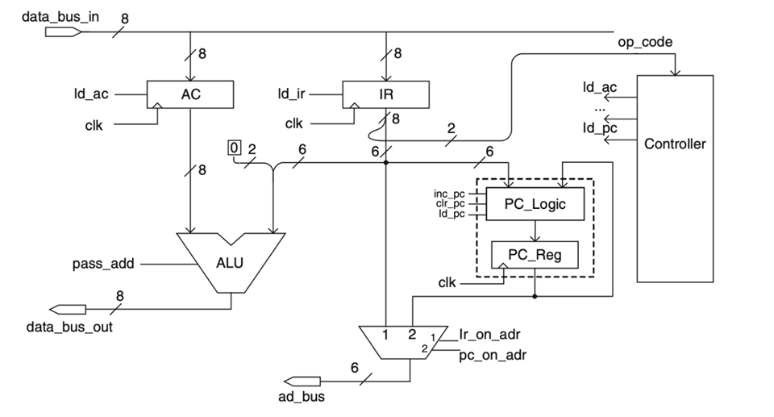

# CPU Implementation and Lucas Series Calculation Using Verilog

This project consists of two sections: the implementation of a simple CPU using Verilog, and the implementation of the Lucas series using this CPU.

  

## Section 1: CPU Implementation

### CPU Design

The CPU is designed using Verilog and includes the following components:

- **Instruction Set**: The CPU supports four instructions: load, store, add, and jump.
- **Main Components**:
  - **Program Counter (PC)**: Keeps track of the instruction address.
  - **Instruction Register (IR)**: Holds the current instruction.
  - **Accumulator (AC)**: Used for arithmetic and logic operations.
  - **Arithmetic Logic Unit (ALU)**: Performs arithmetic and logic operations.

### Data Path and Controller

1. **Data Path**:
   - The CPU interacts with memory using input-bus, output-bus, and address-bus.
   - **Memory**: 64-byte memory for storing instructions and data.
   - **ALU**: Performs operations based on the opcode and inputs from AC and IR.
   - **Control Unit**: Generates control signals to manage data flow and operations.

2. **Controller**:
   - Controls the execution of instructions by generating appropriate signals.
   - Manages the sequencing of operations based on the instruction set.

### Instruction Execution Example

1. **Load**: Load data from memory to AC.
   - Opcode: `00`
   - Example: `AC = mem[addr]`
2. **Store**: Store data from AC to memory.
   - Opcode: `01`
   - Example: `mem[addr] = AC`
3. **Add**: Add data from memory to AC.
   - Opcode: `10`
   - Example: `AC = AC + mem[addr]`
4. **Jump**: Jump to a specified address.
   - Opcode: `11`
   - Example: `PC = addr`

### Testing

The CPU is tested with various instructions to ensure correct functionality. Below are the key steps for testing:

1. **Reset** the system.
2. **Load** instructions into memory.
3. **Execute** instructions step by step.
4. **Verify** the output against expected results.

## Section 2: Lucas Series Implementation

### Lucas Series Calculation

The Lucas series is calculated using the implemented CPU. The Lucas series is defined as:
\[ L(n) = L(n-1) + L(n-2) \]
with initial values \( L(0) = 2 \) and \( L(1) = 1 \).

### Modifications for Lucas Series

1. **ACII Register**: An additional register to hold intermediate values.
2. **New Instructions**: Additional instructions to support the calculation.
   - Example: `ACII = AC + ACII`

### Instruction Execution Example for Lucas Series

1. **Initialize** the values in memory:
   - `mem[8] = L(n-2)`
   - `mem[9] = L(n-1)`

2. **Execute** the series of instructions:
   - `PC = 1 / Execute mem[1] / AC = mem[8] // (L(n-2))`
   - `PC = 2 / Execute mem[PC] / ACII = AC // (L(n-2))`
   - `PC = 3 / Execute mem[PC] / AC = mem[9] // (L(n-1))`
   - `PC = 4 / Execute mem[PC] / ACII = AC + ACII // (L(n))`
   - `PC = 5 / Execute mem[PC] / mem[9] = ACII // (L(n-1) = L(n))`
   - `PC = 6 / Execute mem[PC] / mem[8] = AC // (L(n-2) = L(n-1))`
   - `PC = 7 / Execute mem[PC] / jump h00 // restart`

### Testing Lucas Series

The sequence is tested by initializing memory with the appropriate starting values and executing the instructions. The results are verified against the expected Lucas series values.

## Conclusion

This project demonstrates the implementation of a simple CPU using Verilog and its application in calculating the Lucas series. The CPU design includes essential components and supports basic instructions, while the Lucas series implementation showcases its practical use.

